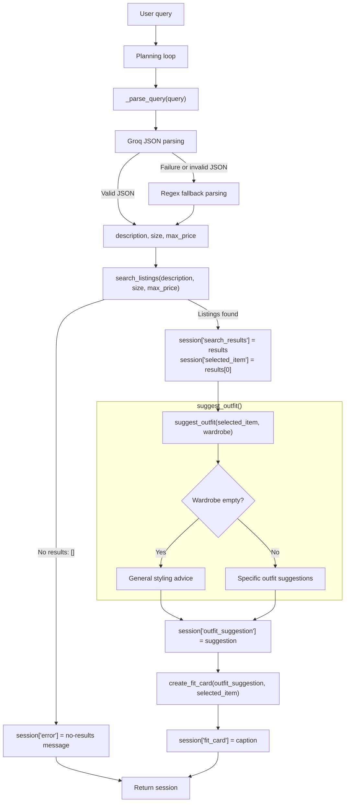

# FitFindr

FitFindr is a multi-tool AI agent for finding mock secondhand clothing listings, suggesting outfits around a selected item, and generating a short social-media-style fit card. Its Gradio interface accepts a clothing request and a wardrobe choice, then shows the top listing, an outfit idea, and a caption.

The project uses mock listing data only. It does not browse live resale marketplaces or predict physical garment fit.

## What's Included

```text
ai201-project2-fitfindr-starter/
├── data/
│   ├── listings.json          # 40 mock secondhand listings
│   └── wardrobe_schema.json   # Wardrobe format + example wardrobe
├── tests/
│   ├── test_agent.py          # Parser and planning-loop tests
│   └── test_tools.py          # Tool tests and failure cases
├── utils/
│   └── data_loader.py         # Helper functions for loading the data
├── .gitignore                 # Excludes local environment and secret files from Git
├── README.md                  # Project documentation
├── agent.py                   # Planning loop and session state management
├── app.py                     # Gradio interface and query handler
├── planning.md                # Agent specification and architecture diagram
├── requirements.txt           # Python dependencies
└── tools.py                   # Three standalone FitFindr tools

```

## Setup

**macOS / Linux:**
```bash
python -m venv .venv
source .venv/bin/activate
pip install -r requirements.txt
```

**Windows:**
```bash
python -m venv .venv
source .venv/Scripts/activate
pip install -r requirements.txt
```

Set your Groq API key in a `.env` file (get a free key at [console.groq.com](https://console.groq.com)):
```
GROQ_API_KEY=your_key_here
```

Run the application:
```
python app.py
```
Open the localhost URL printed in the terminal.

Run the tests:
```
pytest tests/
```

## The Mock Listings Dataset

`data/listings.json` contains 40 mock secondhand listings across categories (tops, bottoms, outerwear, shoes, accessories) and styles (vintage, y2k, grunge, cottagecore, streetwear, and more).

Each listing has: `id`, `title`, `description`, `category`, `style_tags`, `size`, `condition`, `price`, `colors`, `brand`, and `platform`.

Load it with:
```python
from utils.data_loader import load_listings
listings = load_listings()
```

## The Wardrobe Schema

`data/wardrobe_schema.json` defines the format your agent uses to represent a user's existing wardrobe. It includes:

- `schema`: field definitions for a wardrobe item
- `example_wardrobe`: a sample wardrobe with 10 items you can use for testing
- `empty_wardrobe`: a starting template for a new user

Load an example wardrobe with:
```python
from utils.data_loader import get_example_wardrobe
wardrobe = get_example_wardrobe()
```

## Tool Inventory

| Tool Name | Purpose | Parameters (Inputs) | Returns (Outputs) |
|---|---|---|---|
| `search_listings` | Searches the mock secondhand clothing listings for relevant items. | `description` (`str`): a short query phrase describing the item the user wants, such as `"vintage graphic tee"`; `size` (`str \| None = None`): optional requested size; `max_price` (`float \| None = None`): optional inclusive maximum price. | A relevance-sorted `list[dict]` of matching listings. Each listing includes `id`, `title`, `description`, `category`, `style_tags`, `size`, `condition`, `price`, `colors`, `brand`, and `platform`. Returns `[]` when no listings match. |
| `suggest_outfit` | Generates outfit suggestions using a selected listing and the user's wardrobe. | `new_item` (`dict`): selected listing; `wardrobe` (`dict`): wardrobe containing an `items` list. | A non-empty outfit suggestion (`str`). With an empty wardrobe, it returns general styling advice. |
| `create_fit_card` | Generates a short social-media-style caption for the selected item and outfit. | `outfit` (`str`): outfit suggestion; `new_item` (`dict`): selected listing. | A 2–4 sentence fit-card caption (`str`). If `outfit` is empty or whitespace-only, it returns a descriptive error string. |
---

## Planning Loop



### 1. Query Parsing

`run_agent()` begins by creating a new session dictionary. It calls a private `_parse_query()` helper that uses Groq JSON parsing with a deterministic regex fallback.

Missing size or price values are stored as `None`. The helper returns a dictionary with `description`, `size`, and `max_price`, which `run_agent()` stores in `session["parsed"]`. The regex fallback removes matched size and price phrases plus common request or wardrobe-context phrases before producing the description.

### 2. Item Search

The agent calls `search_listings()` first with the parsed description, size, and maximum price. The returned list is stored in `session["search_results"]`.

### 3. No-Results Branch

If `session["search_results"]` is empty, the agent stores a helpful message in `session["error"]` telling the user to try different keywords, a different size, or a higher budget. It then returns immediately without calling `suggest_outfit()` or `create_fit_card()`.

### 4. Outfit and Fit Card Generation

If search results exist, the agent stores the first result as `session["selected_item"]`. It passes that exact listing dictionary and `session["wardrobe"]` into `suggest_outfit()`.

Inside `suggest_outfit()`, a non-empty wardrobe produces recommendations that name specific wardrobe pieces. An empty wardrobe produces general styling advice instead, without claiming the user owns any particular item. In either case, the returned text is stored in `session["outfit_suggestion"]`.

The agent then passes `session["outfit_suggestion"]` and the same `session["selected_item"]` into `create_fit_card()`. It stores the returned caption in `session["fit_card"]` and returns the completed session.

## State Management

For each request, `run_agent()` in `agent.py` creates one session dictionary. It stores the original `query`, parsed search values in `parsed`, the full `search_results`, the chosen `selected_item`, the selected `wardrobe`, the generated `outfit_suggestion`, the final `fit_card`, and an `error` message when the workflow stops early.

After `search_listings()` returns, the agent stores its list in `session["search_results"]` and saves the first result as `session["selected_item"]`. That exact listing dictionary is passed to `suggest_outfit()` with `session["wardrobe"]`.

The outfit text returned by `suggest_outfit()` is stored in `session["outfit_suggestion"]` and passed directly into `create_fit_card()` with the same `selected_item`.

`app.py` receives the completed session only for the current request. It formats `selected_item` for the first panel and returns `outfit_suggestion` and `fit_card` for the other two panels. It does not persist the session after the handler finishes.

## Interaction Walkthrough

The outputs below are from one tested run. Wording may vary because the outfit suggestion and fit card are generated by Groq.

**User query:**

```text
I'm looking for a vintage graphic tee under $30. I mostly wear baggy jeans and chunky sneakers. What's out there and how would I style it?
```

**Step 1 — Tool called:**
- Before calling a tool, `run_agent()` calls `_parse_query(query)`. For this request, the parser returns:
  ```python
  {
      "description": "vintage graphic tee",
      "size": None,
      "max_price": 30.0,
  }
  ```
- Tool: `search_listings`
- Input: `search_listings(description="vintage graphic tee", size=None, max_price=30.0)`
- Why this tool: The agent needs a matching listing before it can suggest an outfit or create a fit card.
- Output: The tool returned a relevance-sorted list of matching listings. The top result was:

  ```text
  Title: Y2K Baby Tee — Butterfly Print
  Size: S/M
  Condition: excellent
  Price: $18.0
  Platform: depop
  ```

**Step 2 — Tool called:**
- Tool: `suggest_outfit`
- Input: `suggest_outfit(new_item=<selected Y2K Baby Tee listing>, wardrobe=<example wardrobe>)`
- Why this tool: The selected listing is now available, so the tool can combine it with items from the user's wardrobe.
- Output: The tool returned two outfit suggestions. One paired the tee with baggy straight-leg jeans and chunky white sneakers for a casual streetwear look. The other layered it under an oversized grey crewneck sweatshirt with black combat boots for a cozier, more grunge-inspired outfit.

**Step 3 — Tool called:**
- Tool: `create_fit_card`
- Input: `create_fit_card(outfit=<outfit suggestion>, new_item=<selected Y2K Baby Tee listing>)`
- Why this tool: The tool needs both the selected listing details and the outfit suggestion to create a social-media-style caption.
- Output: One tested run returned:

  ```text
  I'm obsessed with my latest thrift find, the Y2K Baby Tee — Butterfly Print, which I scored for $18.0 on depop. I've been pairing it with baggy straight-leg jeans and chunky white sneakers for a casual, streetwear-inspired vibe that's perfect for a laid-back day out. The butterfly print adds a touch of whimsy to the overall look, and I also love layering it under an oversized grey crewneck sweatshirt and pairing with black combat boots for a cozy, contrasting style.
  ```

**Final output to user:**

The first panel shows the selected listing's title, size, condition, price, and platform. The second panel shows the outfit suggestion, and the third panel shows the generated fit card.

---

## Error Handling and Fail Points

| Tool | Failure mode | Agent response |
|------|-------------|----------------|
| `search_listings` | No listings match the query. | The tool returns an empty list. The agent tells the user to try different keywords, a different size, or a higher budget, then stops before calling the later tools. |
| `suggest_outfit` | The wardrobe is empty. | The tool treats this as a supported case and returns general styling advice instead of naming wardrobe pieces. The workflow can continue to create a fit card. |
| `create_fit_card` | The outfit input is empty or whitespace-only. | The tool returns a descriptive error string instead of raising an exception. In the normal workflow, this should not occur because `suggest_outfit()` returns non-empty text. If it does occur, `run_agent()` stores the returned string in `session["fit_card"]`, and `app.py` displays it in the third panel. |

**Example from testing:**  
I tested the query `designer ballgown size XXS under $5`, which returned no matching listings. FitFindr showed a no-results message and did not generate an outfit suggestion or fit card.

## Spec Reflection

**One way planning.md helped during implementation:**

The planning document defined the expected behavior of each tool before I implemented the agent workflow. For example, it specified what each tool should return for edge cases, such as no search results, an empty wardrobe, or an empty outfit. That made it straightforward to implement and test each tool individually before connecting them in run_agent().

**One divergence from your spec, and why:**

My initial spec used regex-only parsing for the user's description, size, and price. During testing, I found that a longer conversational request could leave wardrobe context in the search description and affect ranking. The final implementation instead uses Groq JSON parsing to isolate the requested item, with a deterministic regex fallback if the model call, JSON parsing, or validation fails.

---

## AI Usage

### 1. Tool implementation and testing

- **AI tool used:** Claude Agent
- **Input provided:** I gave Claude the Tool 1 requirements from `planning.md`, the `search_listings()` stub in `tools.py`, `utils/data_loader.py`, and `data/listings.json`.
- **What it generated:** Claude generated filtering for optional size and price, then keyword-based relevance ranking for listings.
- **Review and verification:** An initial version required every query keyword to match by using `query_keywords.issubset(item_words)`, which did not produce true overlap ranking. I reviewed the logic, asked Claude to revise it to count `query_keywords & item_words`, then ran `pytest tests/` and manual search cases.

### 2. Agent workflow and interface integration

- **AI tool used:** Claude Agent
- **Input provided:** I gave Claude the Planning Loop, State Management, Error Handling, and Architecture sections from `planning.md`, along with `agent.py` and `app.py`.
- **What it generated:** Claude generated `run_agent()` with a private `_parse_query()` helper that uses Groq JSON parsing with a deterministic regex fallback, a no-results early return, and the Gradio `handle_query()` function that maps results to the three output panels.
- **Review and verification:** I checked that the no-results branch stops before later tools run. I tested a normal query, `designer ballgown size XXS under $5`, a blank query, and an empty-wardrobe query through the interface. I also temporarily replaced the later tools with functions that would raise an error; the no-results path completed without calling them.I also added `tests/test_agent.py` to verify the Groq JSON parsing path, the regex fallback path, the no-results early return, and exact state handoff between `search_listings()`, `suggest_outfit()`, and `create_fit_card()`.